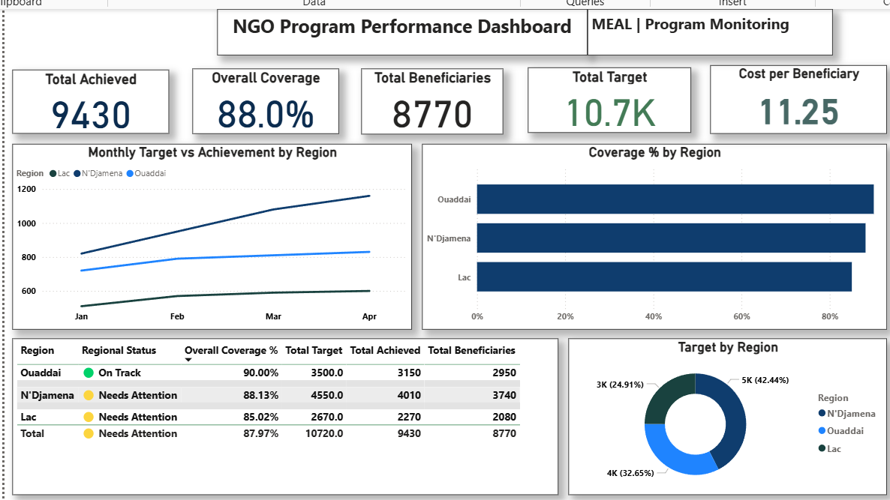

# NGO MEAL Performance Dashboard

## Power BI Dashboard for Program Monitoring & Decision Support

A demonstration Power BI dashboard designed to help NGO and humanitarian program teams monitor program performance, compare regional results, track beneficiaries, and identify areas requiring management attention.

**Project Type:** Demonstration Project  
**Domain:** NGO / Humanitarian / Public Health  
**Focus:** MEAL / Program Monitoring / Data Analytics  
**Tools:** Power BI | DAX | Excel

---

## Dashboard Preview

---

## Project Overview

NGO program teams often manage routine monitoring data across Excel files and reporting systems. This can make it difficult to quickly identify performance gaps, compare regions, monitor beneficiaries, and track resource utilization.

This project demonstrates how routine program monitoring data can be transformed into an interactive Power BI dashboard that provides a consolidated management view.

---

## The Challenge

Program teams need to answer important monitoring questions such as:

- Are we achieving our program targets?
- Which regions are performing well?
- Which regions require management attention?
- How many beneficiaries have been reached?
- What is the overall program coverage?
- How does performance change over time?
- How efficiently are resources being utilized?

The dashboard was designed to provide these insights in a single interactive reporting environment.

---

## The Solution

I developed an interactive MEAL Performance Dashboard using Power BI.

The dashboard brings key program indicators into one management view, including:

- Target vs. Achievement
- Overall Coverage %
- Beneficiaries Reached
- Regional Performance
- Regional Performance Status
- Monthly Performance Trends
- Budget / Resource Utilization
- Cost per Beneficiary

---

## Key Performance Indicators

The demonstration dashboard shows:

| KPI | Value |
|---|---:|
| Total Achieved | 9,430 |
| Overall Coverage | 88.0% |
| Total Beneficiaries | 8,770 |
| Total Target | 10,720 |
| Cost per Beneficiary | 11.25 |

---

## Regional Performance

| Region | Coverage | Status |
|---|---:|---|
| Ouaddai | 90.00% | On Track |
| N'Djamena | 88.13% | Needs Attention |
| Lac | 85.02% | Needs Attention |

Ouaddai shows the strongest regional coverage, while Lac has the lowest coverage and represents a priority area for management review.

---

## Management Insights

The dashboard helps program managers quickly identify where attention is needed.

### 1. Monitor performance against targets

Target-versus-achievement analysis helps teams identify performance gaps.

### 2. Compare regional performance

Regional coverage makes it possible to identify stronger and weaker implementation areas.

### 3. Identify areas requiring attention

The regional status classification highlights areas that may require follow-up or corrective action.

### 4. Monitor beneficiary reach

Beneficiary indicators provide a direct view of program reach.

### 5. Support evidence-based decisions

A consolidated dashboard allows program teams to move from raw monitoring data toward actionable management information.

---

## Technical Approach

The dashboard was developed using structured routine monitoring data and Power BI.

### Tools

- Power BI
- DAX
- Excel

### Key analytical components

- Data preparation
- KPI development
- DAX measures
- Coverage calculations
- Target-versus-achievement analysis
- Regional comparison
- Performance status classification
- Cost-per-beneficiary analysis
- Monthly trend analysis
- Interactive dashboard design

---

## Dashboard Components

The dashboard includes:

### KPI Cards

- Total Achieved
- Overall Coverage
- Total Beneficiaries
- Total Target
- Cost per Beneficiary

### Visualizations

- Monthly Target vs Achievement by Region
- Coverage % by Region
- Target by Region
- Regional Performance Table

---

## MEAL Use Case

This dashboard can support routine program monitoring activities such as:

- Monitoring program indicators
- Reviewing progress against targets
- Comparing geographic areas
- Identifying performance gaps
- Supporting program review meetings
- Tracking beneficiary reach
- Supporting management decisions
- Improving routine reporting

---

## Project Deliverables

This repository contains:

- Power BI dashboard
- Dashboard screenshot
- MEAL dashboard case study
- Project documentation

---

## Case Study

A detailed case study describing the challenge, solution, findings, management insights, and technical approach is available in:

`case-study/NGO_MEAL_Performance_Dashboard_Case_Study.pdf`

---

## Data Disclaimer

This is a **demonstration project using sample data**.

The data does not represent the actual performance of any organization, NGO, humanitarian program, or geographic implementation area.

The project was developed for portfolio, demonstration, and professional learning purposes.

---

## Professional Focus

This project demonstrates skills relevant to:

- MEAL
- Monitoring & Evaluation
- Program Data Analytics
- Health Data Analytics
- Public Health
- NGO Program Monitoring
- Power BI Dashboard Development
- Data Visualization
- Evidence-Based Decision Making

---

## About

**Oumar Mahamat Ahmat**

MPH Epidemiology | Public Health & Health Data Analytics

Focus areas:

- Epidemiological Analysis
- Health Data Analytics
- MEAL / M&E
- Disease Surveillance
- Power BI
- DHIS2
- SQL
- Python
- R

Portfolio:  
https://oumarfarouknew-maker.github.io/epidata.solutions/

---

## License

MIT License
